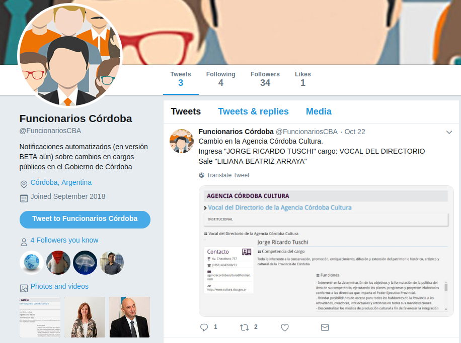

# Funcionarios 
Detección de cambios en los organigramas de Provincia y Municipalidad de Córdoba

## Publicacion

Esperamos tener un sitio web con todos los registros. Por el momento la cuenta 
de twitter [@funcionariosCBA](https://twitter.com/funcionariosCBA) publica manualmente los cambios.  



## Base de datos

La base de datos **general** se administrará (sin terminar) en django en [funcgo/](funcgo/README.md) (**func**ionarios-djan**go**).  
Luego cada institucion (provincia, muni, cuerpos legislativos, etc) tiene un directorio con una metodología de detección de cambios diferente.  

### Ejecutar

Cargar variables de entorno

```
# cargar variables de entorno
source .env
# detectar cambios en cada ámbito
./funcionarios_prov_cba/daily.sh

```